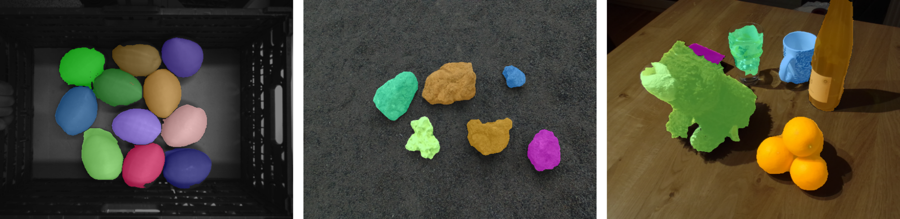
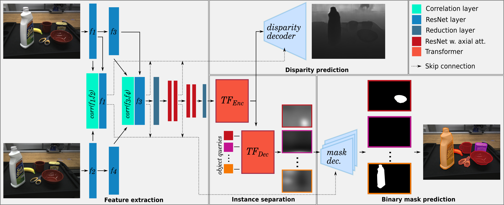

# Unknown Object Segmentation from Stereo Images
<p align="center">

<p>
    
__Unknown  Object  Segmentation  from  Stereo  Images__ Maximilian Durner*, Wout Boerdijk*, Martin Sundermeyer, Werner Friedl, Zoltan-Csaba Marton, and Rudolph Triebel.
Accepted at IROS2021.
[paper](https://arxiv.org/pdf/2103.06796.pdf), [dataset](https://www.dlr.de/rm/desktopdefault.aspx/tabid-17628/#gallery/36367)

## Overview
<p align="center">

<p>

#### Abstract
Although instance-aware perception is a key prerequisite for many autonomous
robotic applications, most of the methods only partially solve the problem
by focusing solely on known object categories.
However, for robots interacting in dynamic and cluttered environments, this
is not realistic and severely limits the range of potential applications.
Therefore, we propose a novel object instance segmentation approach that
does not require any semantic or geometric information of the objects
beforehand.
In contrast to existing works, we do not explicitly use depth data as input, but rely on the insight that slight viewpoint changes, which for
example are provided by stereo image pairs, are often sufficient to
determine object boundaries and thus to segment objects.
Focusing on the versatility of stereo sensors, we employ a transformer-based
architecture that maps directly from the pair of input images to the object
instances.  This has the major advantage that instead of a noisy, and
potentially incomplete depth map as an input, on which the segmentation is
computed, we use the original image pair to infer the object instances and a
dense depth map.
In experiments in several different application domains,
we show that our __Instance Stereo Transformer (INSTR)__ algorithm outperforms current
state-of-the-art methods that are based on depth maps.
Training code and pretrained models are available at [https://github.com/DLR-RM/instr](https://github.com/DLR-RM/instr).

## Citation
If you find our work useful, please cite us:
```
@article{durner2021unknown,
    title={Unknown Object Segmentation from Stereo Images}, 
    author={Maximilian Durner and Wout Boerdijk and Martin Sundermeyer and Werner Friedl and Zoltan-Csaba Marton and Rudolph Triebel},
    year={2021},
    eprint={2103.06796},
    archivePrefix={arXiv},
    primaryClass={cs.CV}
}
```

## Content Description
This repository contains code and a pre-trained model for the __Instance Stereo Transformer (INSTR)__, and everything necessary to reproduce the main results presented in our paper.
It also contains scripts to generate synthetic data, and a demo script.

## Requirements: Hardware
### For Training
Nvidia GPU with >= 11GB memory (or adjust the batch size). We trained on a Nvidia RTX 2080 Ti.

### For Testing
Nvidia GPU with >= 3GB memory

## Requirements: Software

It is reommended that you use a [conda environment](https://conda.io/projects/conda/en/latest/user-guide/install/index.html) for installation.
Run `conda env create -f environment.yaml` to install a conda environment named *instr*.
Then, run `conda activate instr` to activate it.

## Getting Started

### Pre-trained Model

We provide a pre-trained model ([link](https://drive.google.com/uc?id=1wFSTa5IoJYUTYpGeunE7SzXMfqRWXHi7)). With it you can
- reproduce the main results from the paper
- directly use it for a demo
- use it as an initial starting point for fine-tuning

Read the following for more information.

### Train / Fine-tune INSTR

To train INSTR from scratch following the procedure in the paper first create the synthetic dataset (see the [README](./blenderproc/README.md)).
Otherwise, adapt the [dataloader](./data_io/data_loader.py) accordingly, if you want to fine-tune / train on another dataset.
Adapt the paths in the [config](./configs/config.yaml), expecially lines 9, 13 and 17. 
The config format follows [YACS](https://github.com/rbgirshick/yacs), so you can also easily modify options via the command line (see command below).

To start a training, run `python train.py --config-file configs/config.yaml OPTIONAL_ARGS`, where `OPTIONAL_ARGS` overwrite config settings. 
For example, `python train.py --config-file configs/config.yaml MODEL.AUX_DECODER_LOSS False AXIAL_ATTENTION False` will train without disparity loss and axial attention.

Running with the default config will store config, models and tensorboard visualization in `./output/instr_{time_stamp}`.

For fine-tuning it is suggested to reduce the learning rate by a factor of 10, e.g. `python train.py --config-file configs/config.yaml OPTIMIZER.LR 0.00001`.

### Evaluate INSTR on STIOS
STIOS is a table-top object dataset recorded by two stereo sensors with manual annotated instances for each frame ([website](https://www.dlr.de/rm/en/desktopdefault.aspx/tabid-17628/#gallery/36367), [code utilities](https://github.com/DLR-RM/stios-utils)).
To evaluate and reproduce the experiments in the paper (Tab. 2), [download STIOS](https://zenodo.org/record/4706907#.YROCeDqxVhE) and the [pretrained model](https://drive.google.com/uc?id=1wFSTa5IoJYUTYpGeunE7SzXMfqRWXHi7).
Extract the pretrained model in the project's root directory.
Then, run `python predict_stios.py --state-dict pretrained_instr/models/pretrained_model.pth --root /path/to/stios {--rcvisard, --zed}`.
This will generate mIoU and F1 scores for every scene.

### Demo
Download the [pretrained model](https://drive.google.com/uc?id=1wFSTa5IoJYUTYpGeunE7SzXMfqRWXHi7) and extract the contents here.
Overwrite the [camera class](demo.py) so that it returns a pair of stereo images (RGB, np.array, uint8) from your stereo camera.
Then, run `python demo.py` for the default demo.

Run `python demo.py --help` or have a look at the [predictor class](predictor.py) for further information.
